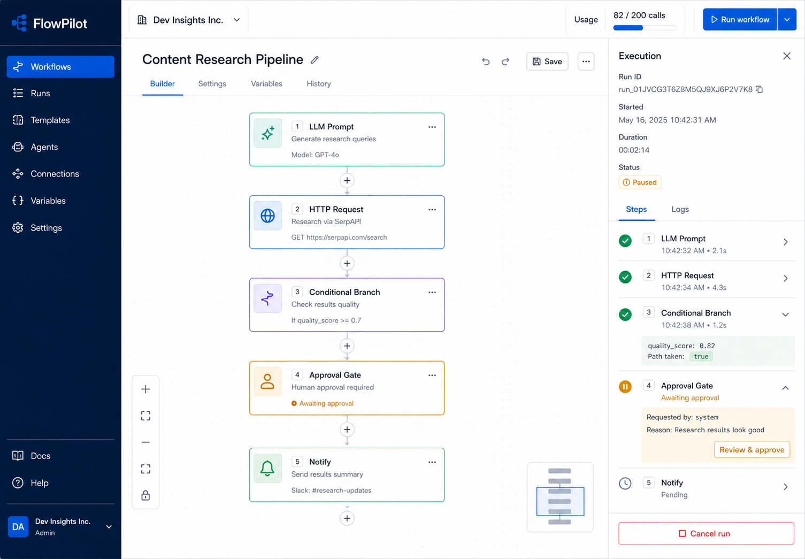

# FlowPilot — AI Agent Workflow Builder

FlowPilot is a full-stack submission for the AI Agent Workflow Builder assignment. It is a Next.js workflow workspace with a local, runnable execution engine and a production Nhost/Hasura implementation package (migrations, tracked metadata, GraphQL operations, Actions, cron trigger, and event trigger).



## Live preview

[Open the deployed FlowPilot app](https://ai-agent-workflow-builder-jet.vercel.app)

## What works now

- A polished React/Next.js builder for a multi-step workflow: LLM call → HTTP request → conditional branch → approval gate → notify.
- A fast live browser execution demo: a manual run progresses one step at a time; the approval step pauses the run; approving it continues to completion without a refresh or background polling.
- Retry behavior for the HTTP node (one retry before an explicitly visible fallback) and quota enforcement before each run.
- A webhook that starts the same run without the button:
  ```sh
  curl -X POST http://localhost:3000/api/webhook/content-research \
    -H 'x-webhook-secret: demo-webhook-key'
  ```
- A role/organization switcher that demonstrates owner, editor, viewer, and a user in a second organization. Org B cannot query the known Org A workflow ID, trigger it, or approve it.
- Owner-only enforcement for sensitive step types (`notify`, `db_write`) and webhook triggers. Viewer users cannot run or approve.
- A visual workflow builder: owners/editors can enter Edit Workflow, reorder steps, and add permitted node types. API checks are applied before the in-memory definition changes.

The `llm_call` makes one same-origin request to a server-only OpenAI Responses API route for each run. `OPENAI_API_KEY` is never exposed to the browser or committed. If the secret is not configured or the provider is unavailable, the interface explicitly uses a deterministic fallback so the complete walkthrough remains functional. The HTTP step calls GitHub's public Zen endpoint and retries once in the Action-compatible runner.

## Run locally

```sh
npm install
npm run dev
```

Open [http://localhost:3000](http://localhost:3000). The app starts in the key paused approval scenario. Press **Review & approve**, then test **Run workflow** and **Test webhook trigger**. Switch to **Jordan Lee — Other Company Ltd.** to see the direct-ID cross-org protection take effect.

## GraphQL operations

The production documents are in [src/graphql/operations.js](src/graphql/operations.js):

- `GET_WORKFLOW_WITH_LATEST_RUN` returns an org's workflow, steps, triggers, and last run.
- `UPDATE_WORKFLOW_GRAPH` writes workflow structure.
- `TRIGGER_WORKFLOW_RUN` and `APPROVE_STEP` invoke Hasura Actions.
- `STEP_RUN_PROGRESS` is the `step_runs` subscription filtered to `workflow_run_id` for live UI updates.

## Nhost + Hasura setup

1. Create an Nhost project, enable email authentication, and set the Hasura environment variable `ACTION_BASE_URL` to this deployed app URL. Set `WEBHOOK_SHARED_SECRET` to a long random value in both Nhost and this app.
2. Copy `.env.example` to `.env.local`; set `NHOST_GRAPHQL_URL`, `HASURA_ADMIN_SECRET`, the webhook secret, and `OPENAI_API_KEY` (plus `OPENAI_MODEL` if needed). The key must remain server-only.
3. Apply the SQL migration under [hasura/migrations/default/1700000000000_init/up.sql](hasura/migrations/default/1700000000000_init/up.sql), then apply the metadata in `hasura/metadata`. The metadata tracks relationships, a current-month usage view, action definitions, row-level tenancy permissions, a scheduled trigger, and a database event trigger.
4. Configure Nhost JWT claims so every authenticated request has `x-hasura-user-id` and `x-hasura-role: user`. The org role remains in `org_members`; it must never be a global auth role.
5. Point each Hasura Action handler to `/api/hasura/action`. In a deployed persistent implementation, replace the local store adapter with Hasura mutations while keeping the same authorization checks shown in `lib/authorization.js` and `lib/engine.js`.

## Security model

Cross-organization isolation is not UI-only. Hasura metadata scopes every table through the `organizations → org_members` relation, matching `X-Hasura-User-Id`. The local API makes the same check before returning or mutating a workflow/run. A guessed Org A ID from Org B returns HTTP 403 and exposes no run or approval data.

The second layer lives in the runner/Action: it verifies owner/editor membership before triggering, independently checks an approver's role against the paused run's organization, applies the usage quota, and blocks owner-only step types. Details are in [docs/architecture.md](docs/architecture.md).

## Reviewer walkthrough

1. Sign in/demo-select **Asha Patel, Dev Insights Inc. owner**.
2. Observe the three-plus required types (LLM, HTTP, condition, approval, notify) and the existing manual/webhook triggers.
3. Approve the seeded paused run and watch notify finish live. Start a fresh manual run; it pauses at approval again.
4. Click **Test webhook trigger** to start the same workflow from its inbound endpoint.
5. Select **Jordan Lee, Other Company Ltd. owner**. The request is denied server-side despite retaining Org A's workflow ID in the browser route.
6. Select a viewer to confirm the Run and approve affordances are disabled; select an editor to confirm it can run/approve but cannot add notify/db-write or webhook configuration.

## Repository layout

```text
app/                    Next.js UI and local Action-compatible API routes
lib/                    execution engine, in-memory demo persistence, authorization
hasura/migrations/      PostgreSQL schema migration
hasura/metadata/        tracked relationships, row permissions, Actions and triggers
src/graphql/            production query, mutation, and subscription documents
docs/architecture.md    one-page schema/security/pause-resume reasoning
design/                 generated implementation concept
```
